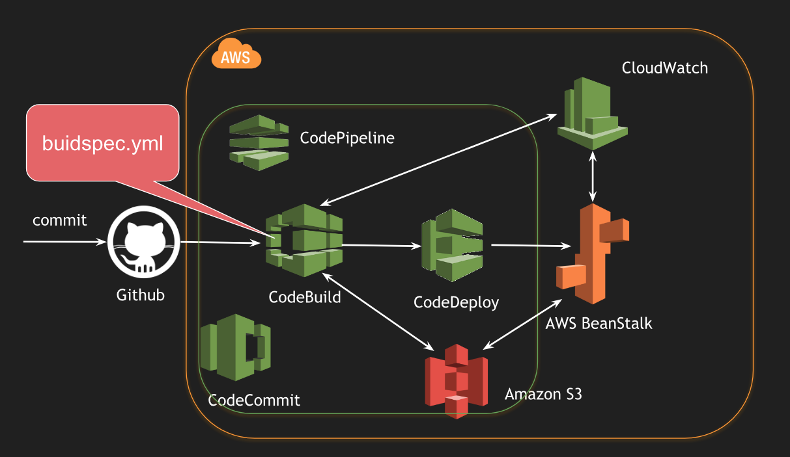

# Continuous Integration and Continuous Deployment using AWS CodePipeline - JAVA Project

## Architecture

## Flow
- Source: Github
- Continuous Integration: AWS CodeBuild - leveraged `buildspec.yml` to build the codebase
- Continuous Deployment: AWS CodeDeploy - leveraged Amazon Elastic BeanStalk for deployment

## REST Endpoint
- Sample `HelloController` enabled under `/hello`# aws-cicd-java
